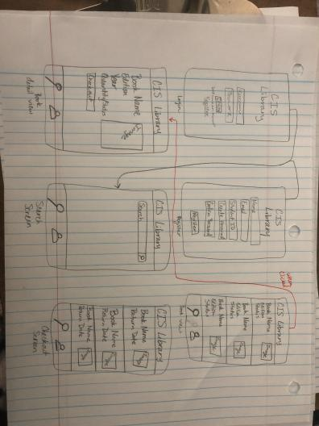

Rattler Coders
===

# FAMU CISMO Library

## Table of Contents
1. [Overview](#Overview)
1. [Product Spec](#Product-Spec)
1. [Wireframes](#Wireframes)
2. [Schema](#Schema)

## Overview
### Description
The library of books in the academic adviser's office is currently kept track of via pencil and paper. As a department full of tech students we should bring the library into the 21st century and allow our library to be tracked electronically. The app will show the catalog of books and show their availability as well as letting students use their student accounts to checkout the books to and from the library.

### App Evaluation
- **Category:** Education
- **Mobile:** Uses push notifications to remind students when their book rentals are due and requires real time data on which books are available or checked out.
- **Story:** As students come to the academic advisor to rent books, instead of having to check in a old folder full of papers with students that graduated years ago, they can search digitally for valid students and the book(s) that want to be requested as well. 
- **Market:** This app's user base would be students in the CIS department. 
- **Habit:** Thihs app would have students return as often as they need to rent/return books for the semester. Ideally it'd be once or twice a week.
- **Scope:** The scope of this project is to have a small set of users and a subset of the library books to "checkout" and "return" for this sprint. Having the capability to search, find, and checkout/return books to the library would be great to have, even with a small subset of the library. As the books increase, it's still just as simple to search and request books for rental.

## Product Spec

### 1. User Stories (Required and Optional)

**Required Must-have Stories**
* Register with FAMU Credentials
* Login using FAMU Credentials 
* Search for CIS Textbooks
* Check out book

**Optional Nice-to-have Stories**
* Update Profile
* Add books to a wishlist/waitlist
* See notifications on book's due dates

### 2. Screen Archetypes
* Register
   * Register with FAMU Credentials
* Login
   * Login using FAMU Credentials 
* Search
    * 
* Profile
	* 

### 3. Navigation

**Tab Navigation** (Tab to Screen)

* Profile
* Catalog/Search

**Flow Navigation** (Screen to Screen)

* Register Activity
   * FAMU ID (required and must start with 300)
   * Student Name
   * Student Email (must end with @famu.edu)
   * Password
   * Button to Navigate to Login Activity if they've already registered
* Login Activity
   * FAMU ID (required and must start with 300)
   * Password
   * Button to Navigate to Login Activity if they've already registered

## Wireframes


### [BONUS] Digital Wireframes & Mockups

### [BONUS] Interactive Prototype

## Schema 
### Models
#### Book
   | Property      | Type     | Description |
   | ------------- | -------- | ------------|
   | bookId        | String   | unique id for the book (default field - Format - "CIS-000") |
   | createdAt    | DateTime | date when book is created (default field) |
   | updatedAt   | DateTime | date when book is last updated (i.e. returned/checked out) (default field) |
   | bookTitle   | String   | Book Title |
   | author       | String   | author of library book |
   | description   | String   | description of textbook |
   | edition       | String   | edition or year of book publication |
   | pageNum       | Number   | number of pages in the textbook |
   | condition     | String   | condition of book upon return |
   | totalQuantity | Number | Number of books in library |
   | freeQuantity  | Number | Number of books for rent (pulled from netw. req.) |
   | coursesUsed   | List of Strings | Course that book is used for |
#### Student
   | Property      | Type     | Description |
   | ------------- | -------- | ------------|
   | studentId     | String   | unique id for the user post (default field) |
   | createdAt     | DateTime | date when Student is created (default field) |
   | updatedAt     | DateTime | date when Student is last updated (default field) |
   | studentNum    | Number   | FAMU Student Number (default field, must begin w/ '300') |
   | email         | String   | FAMU Student Email |
   | password      | String   | FAMU Password |
   | classification | String   | Student Classification |
   | bookRented   | Pointer to Book  | book being rented by student |
   | rentStatus   | Boolean   | Determines if they can check out a book (only 1 book at a time, no overdue books) |
#### Librarian/Admin
   | Property      | Type     | Description |
   | ------------- | -------- | ------------|
   | adminId       | String   | unique id for the user post (default field) |
   | email         | Pointer to User | image author |
   | password      | String     | image that user posts |
### Networking
#### List of network requests by screen
   - Home Feed Screen
      - (Read/GET) Query all posts where user is author
         ```swift
         let query = PFQuery(className:"Post")
         query.whereKey("author", equalTo: currentUser)
         query.order(byDescending: "createdAt")
         query.findObjectsInBackground { (posts: [PFObject]?, error: Error?) in
            if let error = error { 
               print(error.localizedDescription)
            } else if let posts = posts {
               print("Successfully retrieved \(posts.count) posts.")
           // TODO: Do something with posts...
            }
         }
         ```
      - (Create/POST) Create a new like on a post
      - (Delete) Delete existing like
      - (Create/POST) Create a new comment on a post
      - (Delete) Delete existing comment
   - Create Post Screen
      - (Create/POST) Create a new post object
   - Profile Screen
      - (Read/GET) Query logged in user object
      - (Update/PUT) Update user profile image
